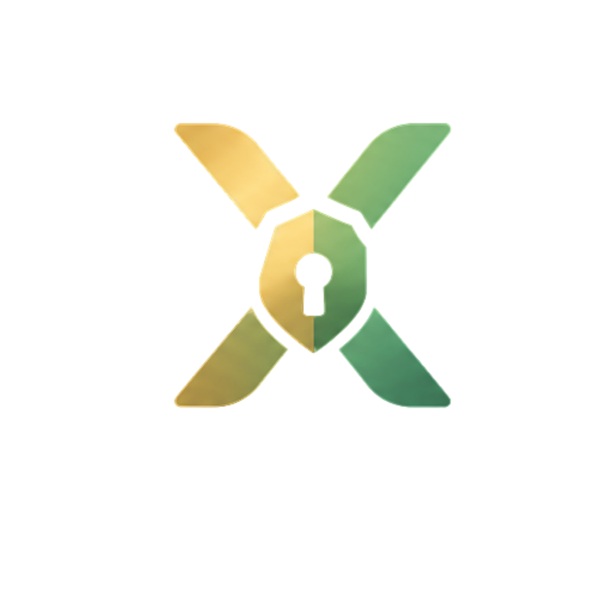
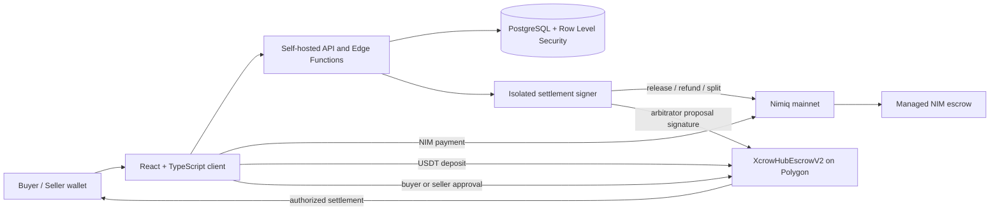

<p align="center">
  
</p>

<h1 align="center">XcrowHub</h1>

<p align="center">
  <strong>Protected crypto deals without blind trust.</strong>
</p>

<p align="center">
  Create clear payment terms, hold funds during delivery, and settle through
  NIM managed escrow or a verified non-custodial USDT contract.
</p>

<p align="center">
  <a href="https://app.xcrowhub.com"><strong>Launch app</strong></a>
  &nbsp;|&nbsp;
  <a href="https://www.xcrowhub.com">Website</a>
  &nbsp;|&nbsp;
  <a href="https://www.xcrowhub.com/docs">Documentation</a>
  &nbsp;|&nbsp;
  <a href="https://www.xcrowhub.com/how-it-works">How it works</a>
  &nbsp;|&nbsp;
  <a href="https://www.xcrowhub.com/marketplace">Marketplace</a>
</p>

<p align="center">
  <a href="https://app.xcrowhub.com">
    
  </a>
  <a href="https://www.nimiq.com/nimiq-pay/">
    
  </a>
  <a href="https://polygonscan.com/address/0x639e0fB779e3D796cAC219850a26Ec3bDcE5d93c#code">
    
  </a>
  <a href="./LICENSE">
    
  </a>
</p>

---

## Why XcrowHub

Direct crypto payments force one party to trust the other: a buyer can pay and
receive nothing, or a seller can deliver and never get paid. XcrowHub replaces
that blind transfer with a deal both parties can inspect before funding.

Every deal records the:

- item or service being purchased;
- exact amount and payment asset;
- delivery deadline and required proof;
- refund terms and confirmation window;
- custody model, fees, and settlement rules.

The buyer funds the agreed rail, the seller delivers, and payment is released
after confirmation. If the parties disagree, the original terms, activity
record, and submitted evidence create a structured dispute path.

## How a deal works

| Step | Action | Result |
| --- | --- | --- |
| **1. Agree** | The seller defines the price, delivery proof, deadline, and refund terms. | XcrowHub creates a private payment link or public marketplace listing. |
| **2. Fund** | The buyer reviews the complete agreement and pays in NIM or USDT. | The selected escrow rail holds the payment during delivery. |
| **3. Deliver** | The seller submits the promised work, product, and supporting proof. | The buyer receives an in-app notification and can review the delivery. |
| **4. Settle** | The buyer confirms delivery, the seller authorizes a refund, or a dispute is resolved. | Funds are released, refunded, or split according to the applicable rail. |

Private deals have **0% platform fees**. Marketplace sales apply a **1%
seller-side fee only after a successful full release**.

## Two transparent escrow rails

Users choose the payment asset and see the custody model before funding.

| | NIM | USDT |
| --- | --- | --- |
| **Network** | Nimiq mainnet | Polygon |
| **Model** | XcrowHub-managed escrow | Non-custodial smart contract |
| **Funding** | Nimiq Pay or a supported Nimiq wallet | Supported EVM wallet |
| **Normal settlement** | Buyer confirmation triggers the isolated settlement signer | Buyer releases to the seller; seller refunds to the buyer |
| **Disputed settlement** | Human evidence review followed by managed release, refund, or split | Two different approvals from the buyer, seller, and immutable arbitrator |
| **Admin authority** | Limited to the managed NIM settlement process | Arbitrator cannot move contract principal alone |

NIM uses managed escrow until the Nimiq Pay integration exposes the multisig
primitives required for a production-quality third-party escrow flow. The
interface labels this model clearly instead of presenting it as non-custodial.

### Verified USDT contract

New USDT deals use `XcrowHubEscrowV2` on Polygon:

[`0x639e0fB779e3D796cAC219850a26Ec3bDcE5d93c`](https://polygonscan.com/address/0x639e0fB779e3D796cAC219850a26Ec3bDcE5d93c#code)

The immutable deployment has:

- no owner or upgradeable proxy;
- no pause authority;
- no rescue or arbitrary-withdrawal function;
- fixed buyer, seller, token, treasury, fee, and arbitrator terms per escrow;
- buyer-controlled full release and seller-controlled full refund;
- two-party EIP-712 authorization for split or disputed settlements;
- an arbitrator that cannot move principal with its signature alone.

The deployed creation and runtime bytecode have an exact Sourcify match, and
the source is published on PolygonScan. Source verification makes the deployed
code inspectable; it is not a substitute for an independent security audit.

See [contracts/README.md](./contracts/README.md) for settlement rules,
deployment details, and local contract verification.

## Product capabilities

### Private deals

- One-time, shareable payment links
- QR codes for second-device and in-person payment
- Configurable proof, refund, deadline, and confirmation terms
- On-chain payment verification
- Delivery submission, buyer confirmation, refunds, and evidence-based disputes

### Marketplace

- Public product and service listings
- Product images and consistent no-image placeholders
- Buy-now and buyer-offer flows
- Quantity and remaining-stock tracking
- Automatic removal from availability when stock reaches zero
- Server-generated NIM cashback scratch cards for eligible completed purchases
- Persistent reward history with exactly-once wallet payouts

### Identity and communication

- Wallet-signature authentication without passwords
- Public profiles, completed-deal statistics, ratings, and feedback
- In-app payment, delivery, offer, message, refund, and dispute notifications
- Optional Telegram alerts when the app is closed
- Referral codes, shareable links, and verified referral counts

### Experience

- Nimiq Pay mini app and responsive browser application
- Mobile-first interface with a dedicated desktop workspace
- Light and dark themes
- Separate first-time tours for Home, Deals, Marketplace, Support, and Profile
- Structured private support tickets linked to deal activity

## Nimiq integration

Nimiq is part of the transaction flow, not a decorative integration.

- `@nimiq/mini-app-sdk` connects XcrowHub inside Nimiq Pay.
- `@nimiq/hub-api` supports compatible browser wallet interactions.
- Wallet signatures authenticate users without email or passwords.
- Users can create NIM deals, and buyers can fund them from a connected wallet.
- Released NIM is settled to the seller's specified Nimiq address.
- Transaction references are verified before a deal is marked as funded.

## Architecture



The frontend uses a Supabase-compatible client protocol, while production
application data is served from XcrowHub's self-hosted VPS infrastructure.
Signing material remains outside the frontend and API functions.

## Technology

- React 18, TypeScript, Vite, Tailwind CSS, Zustand, and Motion
- Nimiq Mini App SDK and Nimiq Hub API
- PostgreSQL with Row Level Security, Realtime, and self-hosted Edge Functions
- ethers.js, Solidity 0.8.26, OpenZeppelin, and Polygon
- An immutable USDT escrow contract
- An isolated Node.js NIM settlement signer with durable payout idempotency

## Repository layout

```text
src/                 Frontend application and wallet adapters
contracts/           Solidity escrow contracts and contract documentation
scripts/             Build, prerender, contract test, and deployment scripts
supabase/functions/  Self-hosted server-side API functions
supabase/migrations/ PostgreSQL schema, policies, and procedures
signer/              Isolated settlement signer
public/              Static assets, PWA metadata, and SEO files
```

## Run locally

### Requirements

- Node.js 20 or newer
- npm
- A PostgreSQL backend exposing the Supabase-compatible API protocol
- A Nimiq wallet for end-to-end NIM testing
- An EVM wallet for Polygon USDT testing

```bash
git clone https://github.com/DropXpert/Xcrowhub.git
cd Xcrowhub
npm install
cp .env.example .env.local
npm run dev
```

On Windows PowerShell, copy the environment template with:

```powershell
Copy-Item .env.example .env.local
```

At minimum, configure the public backend URL and anonymous key in
`.env.local`. The example file documents the public Nimiq, Polygon, USDT, and
escrow contract settings used by the client.

Only public `VITE_` configuration belongs in the frontend environment.
Production seeds, private keys, service-role credentials, signer secrets,
webhook secrets, and live user data must never be committed or exposed to the
client bundle.

Backend and signer deployment details are intentionally separated from the
frontend quick start:

- [Self-hosted backend](./supabase/README.md)
- [Settlement signer](./signer/README.md)
- [USDT contract](./contracts/README.md)

## Verify the project

```bash
npm run typecheck
npm run build
npm run contracts:test
npm run contracts:compile
npm run build --prefix signer
```

These commands validate the TypeScript application, production build,
Solidity escrow behavior, contract compilation, and isolated signer build.

## Security model

- Users authenticate with wallet signatures; XcrowHub never asks for a seed
  phrase or a user's wallet private key.
- Payment references are checked server-side before funded state is accepted.
- Database policies separate user, deal, support, and administrative access.
- NIM payout requests use an isolated signer and durable idempotency journal.
- USDT escrow principal can move only through the contract's published
  settlement rules.
- Secrets are server-side and are not stored in `VITE_` variables.

For a security issue, do not publish sensitive exploit details in a public
issue. Contact **official@xcrowhub.com** with the affected component,
reproduction steps, and potential impact.

## Roadmap

| Phase | Focus | Status |
| --- | --- | --- |
| **Phase 1: Live foundation** | Nimiq Pay mini app, private deals, marketplace bidding, mobile and desktop experiences | Shipped |
| **Phase 2: Work marketplace** | Brand and freelancer hiring, protected milestones, and service-delivery workflows | Planned |
| **Phase 3: Asset expansion** | In-app swaps, more assets and wallets, and deeper Nimiq Pay SDK support | Planned |

## Project links

- [Website](https://www.xcrowhub.com)
- [Application](https://app.xcrowhub.com)
- [Documentation](https://www.xcrowhub.com/docs)
- [How it works](https://www.xcrowhub.com/how-it-works)
- [Marketplace](https://www.xcrowhub.com/marketplace)
- [Support](https://www.xcrowhub.com/support)
- [X / Twitter](https://x.com/xcrowhub)
- [Telegram](https://t.me/xcrowhubtelegram)

## Founder

Built by [DropXpert](https://github.com/DropXpert).

- [X / Twitter](https://x.com/faizionweb3)
- [Telegram](https://t.me/faiziweb3)
- [LinkedIn](https://www.linkedin.com/in/faizidx/)

## License

XcrowHub is available under the [MIT License](./LICENSE). Adapted interface
components retain their original notices in
[THIRD_PARTY_NOTICES.md](./THIRD_PARTY_NOTICES.md).
